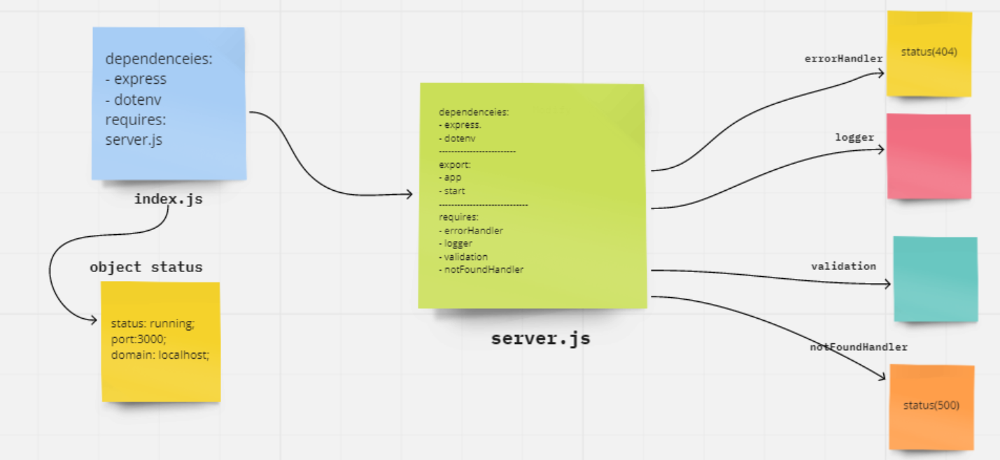

# LAB-2: Express 
#### REPO NAME: basic-express-server

## description

- basic Express server using best practices, including server modularization, use of middleware, and tests.

- By using **GET** methode: Expects a query string from the user with a “name” property,
When present, output JSON to the client with this shape: { name: "name provided" }

- Then make the folowing tests:
404 on a bad route |404 on a bad method |500 if no name in the query string |200 if the name is in the query string |given an name in the query string, the output object is correct.

- Create a **middleware** has 2 middleware modules to it:

* **logger.js**:
1- Performs a console.log with the request method and path
2- Import this into the server and set it up to run at the application level for all routes

* **validator.js**:
1- Checks the query string for a name property
2- Sends the request through when valid, forces an error when not

## basic-express-server

Heroku app link:

GitHub actions link:

Pull Rrequest link:

## UML

